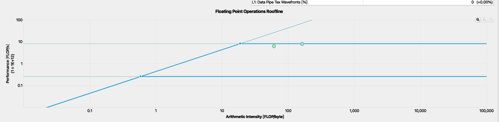

# SGEMM

本文作为李少侠的这篇[[施工中] CUDA GEMM 理论性能分析与 kernel 优化](https://zhuanlan.zhihu.com/p/441146275)与Pzzzzz的这篇[传统 CUDA GEMM 不完全指北](https://zhuanlan.zhihu.com/p/584236348)，脉络上P老师这篇是对李老师的这篇文章的一些细节的补充和扩展，同时P老师也提出了自己的一些疑问。本文的书写目的是在两位老师的基础上进一步完善一些个人可能更在意的点，例如M_BLOCK,M_THREAD等如何从数学上近似求出取值范围，share memory中的内存排布设计原理以及如何结合NCU工具来辅助确定下一步优化的重点。一些前人阐述过的过程这里会指出引用位置。另外本文的书写顺序是按照我的实现顺序记录的，也算是从零开始实现的教程。

# 项目目前进度

本文测试矩阵乘规格为 A(M 4096 * K 4096) * B(K 4096 * N 4096) = C (M 4096 * N 4096),需要注意的是，我选用的A是row major的内存排步，即K是最低维，而B是column major，即K是最低维，C是row major。至于为什么这样选择，是因为后续计划写Q40的矩阵乘法，Q40的weights是column major，可以借鉴这个案例。
目前推进到做好了从Global Memory到smem，smem到reg到tiling，规避了所有的bank conflict，还没做的是double buffer。

  

sgemm roofline analysis, left is what we are going to implement, right comes from cublass

## 量化计算

### 准备工作
我的机器设备是RTX2070s，为了开展我们的理论计算，我们列出了如下规格：

NCU给出的硬件的最大支持

以及一些来自李老师提供的测量[mircobenchmark](https://github.com/Yinghan-Li/YHs_Sample/tree/master/cuda/microbenchmark)的工具:

|                      |                      |
| -------------------- | -------------------- |
| Number of SMs        | 40                   |
| Number of warpSize   | 32                   |
| L2 Cache size:       | 4096 KB              |
| smem latency         | 22 cycles            |
| L1 cache latency     | 32 cycles            |
| L2 cache latency     | 214 cycles           |
| DRAM latency         | 471 cycles           |
| smem cache bandwidth | 9139.200195 GB/s     |
| L2 cache bandwidth   | 1811.228600GB/s      |
| DRAM bandwidth       | read 311.405838GB/s  |
|                      | write 369.402789GB/s |
| Peak TFLOPS          | 7.838 TFLOPS         |

### 基本流程与变量定义
在cuda编程的世界里面访存是第一公民，做矩阵乘法优化的核心手段就是通过L2 cache, smem和register三层cache来缓存近期会重复利用的内存，从而减少对Global Memory的访存次数。我们定义 M_BLOCK, N_BLOCK, K_BLOCK, M_THREAD, N_THREAD，他们的含义为:

|                      |                      |
| -------------------- | -------------------- |
| M_BLOCK        | M范围上每个BLOCK负责的区域大小                   |
| N_BLOCK   | N范围上每个BLOCK负责的区域大小                   |
| K_BLOCK       | K范围上每个BLOCK每次迭代的步长大小              |
| M_THREAD        | M范围上每个THREAD负责的区域大小            |
| N_THREAD     | N范围上每个THREAD负责的区域大小            |

通俗一点来说，每个BLOCK负责计算 M_BLOCK * N_BLOCK 大小的子矩阵，每个THREAD负责计算 M_THREAD * N_THREAD 的子矩阵，每次一个BLOCK缓存 (M_BLOCK + N_BLOCK) * K_BLOCK 大小的矩阵。这里借来P老师的图(有侵权请联系我):

那么这里迎来了本文将解决的第一个问题，我们如何确定这五个变量的值，或者在实现前无法直接地得出具体的值，至少我们可以缩小变量值的搜索范围也是好的。我们将通过例举变量的不等式和假设来完成这一过程。

### 约束关系

#### GLOBAL MEMORY的计算访存比

我们以一个BLOCK为单位来研究一个BLOCK内的计算访存比，首先一个block每次迭代的计算量为$M_{BLOCK}*K_{BLOCK}*N_{BLOCK}*2$，访存量为$(M_{BLOCK}+N_{BLOCK})*K_{BLOCK}*sizeof(fp32)$，那么其计算访存比为$\frac{M_{BLOCK}*N_{BLOCK}}{(M_{BLOCK}+N_{BLOCK})*sizeof(fp32)}=\frac{1}{4*(\frac{1}{M_{BLOCK}}+\frac{1}{N_{BLOCK}})}$。GEMM作为典型的计算boundary的算子，我们期待它的行为是计算时间和访存时间基本覆盖，为了供应计算的需求可以充分利用各级带宽。首先我们保守一点，对于global memory的带宽311.405 GB/s，假设计算单元和带宽跑满时计算强度$I=\frac{7.838 TFLOPS}{311.405 GB/s}=25.77$，也即是计算访存比大于25.77时就有希望可以跑满带宽，这还是在不考虑L2 cache的存在的情况下，每次load都会miss cache的结果。如果我们考虑L2 cache的情况，M，K，N足够大到可以忽略第一次load进L2 cache时候的cache miss，同时L2 cache无限大，我们可以求出对L2的计算强度bar为$I=\frac{7.838 TFLOPS}{1811.22 GB/s}=4.43$。当然，假设L2 cache足够大和MKN足够大的情况很难成立，这里的计算得出的公式是为了每个BLOCK的计算访存比兜底，并尽可能地最大化计算访存比。额外的，我们再假定L2 cache的命中率为$L2_{hitrate}$时，L2和DRAM的等效带宽为$BW_{avg}=311.405*(1-L2_{hitrate})+1811.22*L2_{hitrate} GB/s$最大化利用带宽的计算强度为$I_{avg}=\frac{7.838 TFLOPS}{BW_{avg}}$

综上，所以有:

$$
最低要求的计算强度: 
\frac{1}{4*(\frac{1}{M_{BLOCK}}+\frac{1}{N_{BLOCK}})}>=I_{avg} \tag{1}
$$

$$
最好情况下全命中L2 cache的计算强度: 
\frac{1}{4*(\frac{1}{M_{BLOCK}}+\frac{1}{N_{BLOCK}})}>=25.77 \tag{2}
$$

#### 物理线程的安排

我们假设一个block的组成为block<<<tx, ty>>>, 根据映射关系有：

$$
M_{blk}=t_x*M_{thd}\tag{3}
$$
$$
N_{blk}=t_y*N_{thd}\tag{4}
$$

这里简写了$M_{blk}=M_{block}$, $M_{thd}=M_{thread}$，后文将同样承袭这样的写法。

#### 寄存器，SMEM和thread的占用率

这里是基本的求占用率问题，我们再定义每个block可以最多同时运行的block数量为$Num_{block}$, 每个thread占用的寄存器为$regs_{thd}$:

*register 占用*

$$
Num_{block}*\frac{regs_{thd}*t_x*t_y}{65536} <= 1 \tag{5}
$$

*smem 占用*

$$
Num_{block}*\frac{(M_{blk}+N_{blk})*K_{blk}*sizeof(fp32)}{32768} <= 1 \tag{6}
$$

*thread 占用*

$$
Num_{block}*\frac{t_x*t_y}{1024} <= 1 \tag{7}
$$

#### Break Time

目前为止我们好像列出来几个算式又引入了几个新的变量，我们知道正常情况下N个变量对应N个算式才能求解，看起来我们在越走越远。所以我们需要引入新的约束条件才能继续我们的工作。下面我们将从smem级别的访存计算指令调度延时的角度继续看看有什么是我们可以做的。

#### smem级别的访存计算指令调度

这一节李老师的文章的1.3节后半部已经阐述地很清晰了，基本的原理是warp向LSU发送访存请求本身需要一个周期，而拿到数据这件事本身也是有延时的，那么在这段访存的时间内我们是不是可以调度FMA来做一些计算的工作来充分利用warp scheduler发射指令，保证每个周期平均发射的指令数，让各个单元不要闲下来。题外话，这也是为什么Occupancy是一个重要的考量指标但是有时候不能完全盯着Occupancy看的原因，占用率高的潜台词是scheduler有更多的机会可以发射ready状态的warp指令来隐藏延时，如果有增加指令平均SM发射指令数的方法但是Occupancy会降低，那也是值得做的优化。