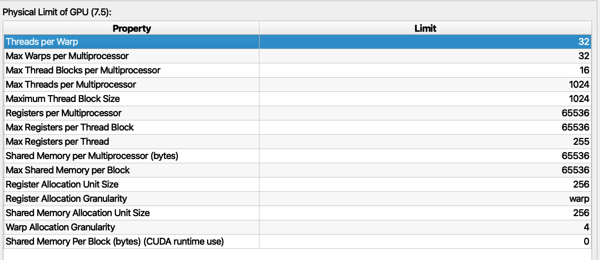

# SGEMM

本文作为李少侠的这篇[[施工中] CUDA GEMM 理论性能分析与 kernel 优化](https://zhuanlan.zhihu.com/p/441146275)与Pzzzzz的这篇[传统 CUDA GEMM 不完全指北](https://zhuanlan.zhihu.com/p/584236348)，脉络上P老师这篇是对李老师的这篇文章的一些细节的补充和扩展，同时P老师也提出了自己的一些疑问。本文的书写目的是在两位老师的基础上进一步完善一些个人可能更在意的点，例如M_BLOCK,M_THREAD等如何从数学上近似求出取值范围，share memory中的内存排布设计原理以及如何结合NCU工具来辅助确定下一步优化的重点。一些前人阐述过的过程这里会指出引用位置。另外本文的书写顺序是按照我的实现顺序记录的，也算是从零开始实现的教程。

# 项目目前进度

本文测试矩阵乘规格为 A(M 4096 * K 4096) * B(K 4096 * N 4096) = C (M 4096 * N 4096),需要注意的是，我选用的A是row major的内存排步，即K是最低维，而B是column major，即K是最低维，C是row major。至于为什么这样选择，是因为后续计划写Q40的矩阵乘法，Q40的weights是column major，可以借鉴这个案例。
目前推进到做好了从Global Memory到slm，slm到reg到tiling，规避了所有的bank conflict，还没做的是double buffer。

  

sgemm roofline analysis, left is what we are going to implement, right comes from cublass

## 量化计算

### 准备工作
我的机器设备是RTX2070s，为了开展我们的理论计算，我们列出了如下规格：

NCU给出的硬件的最大支持

以及一些来自李老师提供的测量[mircobenchmark](https://github.com/Yinghan-Li/YHs_Sample/tree/master/cuda/microbenchmark)的工具:

|                      |                      |
| -------------------- | -------------------- |
| Number of SMs        | 40                   |
| Number of warpSize   | 32                   |
| L2 Cache size:       | 4096 KB              |
| smem latency         | 22 cycles            |
| L1 cache latency     | 32 cycles            |
| L2 cache latency     | 214 cycles           |
| DRAM latency         | 471 cycles           |
| smem cache bandwidth | 9139.200195 GB/s     |
| L2 cache bandwidth   | 1811.228600GB/s      |
| DRAM bandwidth       | read 311.405838GB/s  |
|                      | write 369.402789GB/s |
| Peak TFLOPS          | 7.838 TFLOPS         |

### 基本流程与变量定义