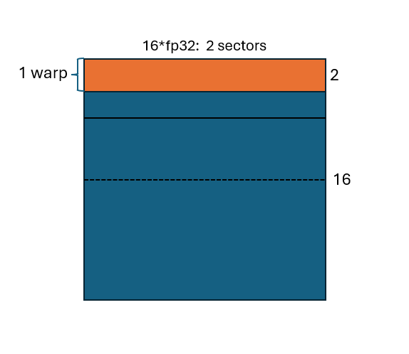
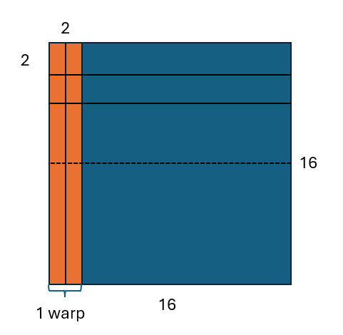
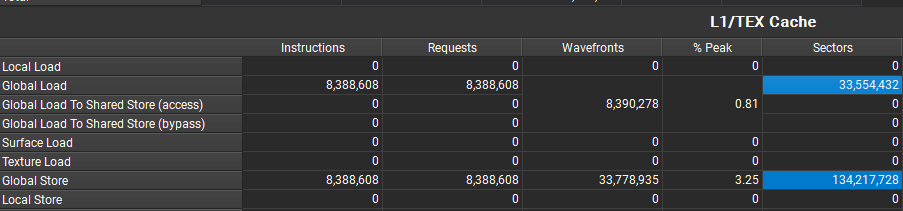
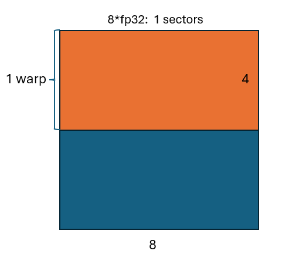
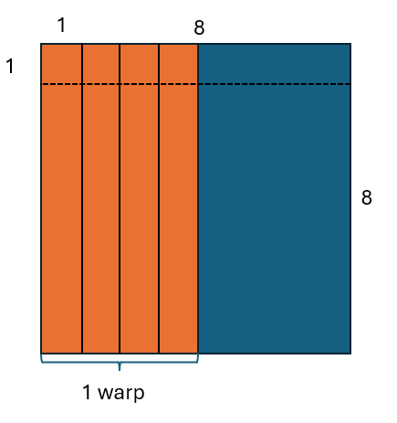
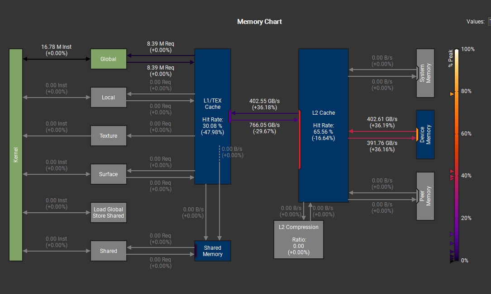

# Transpose

考虑二维矩阵A（MxN）和B(NxM), 实现操作transpose使得对i, j(0<=i<M, 0<=j<N)有：

```
B[j*M+i] = A[i*N+j]
```

## Prepare

1. c++11 required
2. cuda and nvidia driver
3. cmake and make

## Build

```
mkdir build
cd build
cmake ..
make -j
```

## Run

1. GPU
```
./transpose_gpu
```

2. (Optional) CPU
```
./transpose_cpu
```

## Report and Analysis

考虑 M=N=1024 * 16，我们利用nsight system结合理论计算分析我们实现的transpose操作。

### Native Transpose
Tag: `transpose_gpu native kernel`
Native的Transpose非常简单，每一个线程负责一个元素的转置
```
    m_t[x_id * N + y_id] = matrix[y_id * N + x_id];
```
我们设置grid_size<<<N / block_width, N / block_width>>>, block_size<<<block_width, block_width>>>，即grid_size<<<1024, 1024>>>，block_size<<<16, 16>>>。

则我们考虑任意一个线程块（block），其负责转置的是整个矩阵中大小为16x16的一个子矩阵。对于一个block内的线程（thread），物理上并不存在一维和多维的区别，我们知道nv的架构固定32个通道（lane）为一个线程束（warp，SIMD指令执行的基本单位），所以这里有个block中有`16*16/32=8`个warp。逻辑上的threadIdx(x, y)，x是最低维，即tid(0, 0)，tid（1，0）和tid(15, 1)共属于一个warp。

<div style="text-align: center;">
  

</div>

如图所示，同属于一个warp的lane同时对两行16个元素向L1发起访存请求，共32个元素。考虑其中一行的访存情况，16个线程**同一周期中访问的元素组成了连续的16个float32组成的序列**，即对32*sizeof（float）=128B的访问。我们知道L1向L2的访存的最小单位是1 sector=32B，哪怕一个warp中只有一个线程访问了无法合并访存的地址，也会从这个地址传1个sector大小的数据到L1。很幸运的是：1. cudaMalloc的显存都是自动256字节内存对齐的。 2. 我们的native实现中，每16个线程的访问刚好组成了2个sector，访存是合并的。

对于load过程，我们可以量化计算出一个block一共加载了`2 * 2(sectors/warp) * 8(warp/block) = 32(sectors/block)`，对于所有数据有`32(sectors/block) * (1024)^2(blocks) = 33,554,432 sectors`，由于合并了访存，load的sectors利用率是100%。

对于store的过程就有些不一样，因为一个warp load的数据最后被转置储存，通过观察可以发现，这一个warp同一周期中发出的store请求两两位于同一个sector里面，共有16个这样的sector，换句话说，要读出这一个warp的数据需要4个sector，而存完这一个warp的数据需要16个sector。同时我们在这里就可以算出来store过程的sector利用率应该是`2/8(8 * fp32/sector)=25%`，后面我们可以进行验算。

<div style="text-align: center;">
  
</div>

对于store过程，我们可以量化计算出一个block一共存储了`16(sectors/warp) * 8(warp/block) = 128(sectors/block)`，对于所有数据有`128(sectors/block) * (1024)^2(blocks) = 134,217,728 sectors`。如果合并了访存，理想情况下应该和load情况一致，所以现在的访存利用率只有`33,554,432 / 134,217,728 = 0.25`。

从NCU的结果来看，和我们的计算相吻合。
<div style="text-align: center;">
  
</div>

### Transpose With Block(8x8)
Tag: `transpose_gpu native kernel BLOCK SIZE 8`
与Native Transpose相比，该Transpose只在block size上有区别，即block_size<<<8, 8>>>，相对应地设置grid_size<<<2048, 2048>>>。虽然从线程的角度考虑都是一个线程负责转置一个元素，但是从访存上8x8的block_size比16x16更有优势。

对于load过程，一个block一共加载了`4 * 1(sectors/warp) * 2(warp/block) = 8(sectors/block)`，对于所有数据有`8(sectors/block) * (2048)^2(blocks) = 33,554,432 sectors`，因为和block_size<<<16, 16>>>一样合并了访存，所以它们的load的sectors利用率都是100%。

<div style="text-align: center;">
  
</div>

再来看store的过程，不难发现一个warp的寄存器文件（register file）里面储存的将要转置过来的元素是一个WxH(8X4)的shape，那么看store过程的sector利用率的关键就在于，*H个fp32能否填满一个sector*。从图里我们察觉现在的访存利用率应该是50%。

<div style="text-align: center;">
  
</div>

对于store过程，我们可以量化计算出一个block一共存储了`8(sectors/warp) * 2(warp/block) = 16(sectors/block)`，对于所有数据有`16(sectors/block) * (2048)^2(blocks) = 67,108,864 sectors`。如果合并了访存，理想情况下应该和load情况一致，所以现在的访存利用率只有`33,554,432 / 67,108,864 = 0.5`。但无论如何，store的情况应该是比native的版本要好。

由于tranpose的kernel其实非常简单，不涉及可见的计算强度，所以理论上来说kernel的运行时间应该和访存带宽的利用量是对应的。我的机器是RTX4090，理论带宽1008 GB/s。方便起见，我们假定load所有sector的时间是t，那么16x16的store时间是4t，8x8的store时间是2t。在保持带宽（虽然这是倒果为因的）的情况下，理论加速比应该是`(4t+1t)/(2t+1t)=1.67`，而我们测量的时间分别是2.67ms（8x8）和3.63ms（16x16），之比为`3.63/2.67=0.73`。那么我们来考虑L1和L2的带宽变化情况:

<div style="text-align: center;">
  
</div>

则在只考虑访存的情况下，理论加速比应该是`(4+1)/(2/(1-29.67%)+1/(1+36.18%))=0.719`，已经很接近实际的加速比了。当然这样的计算并没有办法先验地完成，因为带宽的变化是结果而不是人为地直接干涉的结果，至少这里说明tranpose的案例受访存的影响是相当大，做优化时应该主要考虑访存情况。